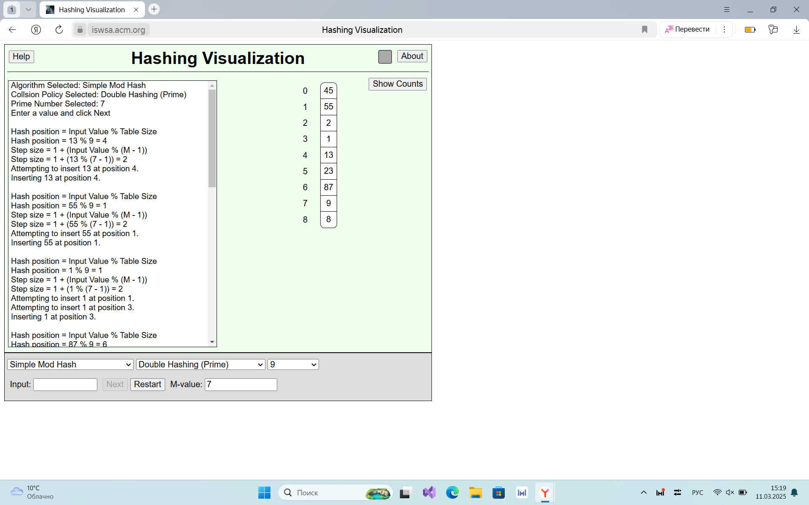

Скриншот:
 

Вариант 15.
Необходимо было использовать метод открытой адресации: двойное хэширование.

Для заполнения хэш-таблицы я создала класс "Пассажир", который содержит следующие поля: имя пассажира, пол и номер его места.
Также он содержит конструктор и деструктор, сеттеры и геттеры для управления полями, функцию печати данных и оператор присваивания.

Далее в коде приведена реализация самой хэш-таблицы.
Для хранения данных я выбрала vector из списка pair ключ-пассажир.
С помощью vector можно легко и быстро обращаться к его элементам, добавлять и удалять их, зная индекс. Pair позволяет удобно хранить данные типа ключ-значение, а так же быстро обращаться и к ключу, и к значению.
Присутствуют 3 хэш-функции: 2 вспомогательные, 1 для реализации "двойного хэширования".
Созданная хэш-таблица обладает основными операциями такими, как: вставка, удаление, поиск элемента, очистка данных. Также для удобства и дополнительных возможностей реализованы функции получения индекса по ключу, проверка на пустоту, подсчет количества элементов и вывод всей таблицы.

В main приведены некоторые проверки функционирования таблицы.
